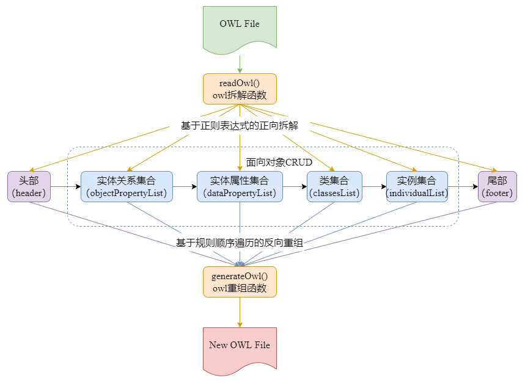

<p align="center">
    <a alt="jionlp logo">
        
    </a>
</p>
<p align="center">
    <a alt="License">
        </a>
    <a alt="Version">
        </a>
    <a href="https://github.com/junchaoIU/AutoProtege/pulse" alt="Activity">
        </a>
    <a alt="Version_Protege">
        </a>
    <a alt="Version_Python">
        </a>
</p>
<p align="center">
<big>A Python Operation Tool Developed for Stanford University's Open Source Ontology Construction Tool Protege</big><br/>
<big>面向斯坦福大学开源本体构建工具protege而开发的python操作工具</big>
</p>

## 🌈 Introduction（简介）
**<big>AutoProtégé： 面向斯坦福大学开源本体构建工具protege而开发的python操作库，支持海量知识自动化映射和管理的自定义解决方案</big>**

斯坦福大学医学院生物信息研究中心基于Java语言开发的本体编辑和知识获取软件Protégé是目前本体知识库构建的重要工具之一，该工具提供了大量的知识模型架构与动作，可创建、可视化、操纵各种表现形式的本体，用于创建知识模型并填充数据。

The ontology editing and knowledge acquisition software prot é g é developed by the biological information research center of Stanford University School of medicine based on Java language is one of the important tools for the construction of ontology knowledge base. The tool provides a large number of knowledge model architecture and actions, and can create, visualize and manipulate ontologies in various forms, which are used to create knowledge models and fill data.

我们总结得到Protégé使用过程中可能面临的几个问题：
- 本地操作，难以进行多人的同步编辑和版本控制
- 难以实现大规模数量级的数据查改及录入
- 需要进行其他先验知识的学习如：本体检索语言，学习成本过高

在大数据的环境下，为适应其应用，我们立足于RDFS/OWL 的语法框架，面向Protégé对知识的描述规则，使用Python编程语言设计了一个本体知识操作库AutoProtégé，提供了一个支持海量知识自动化映射和管理的解决方案。

We summarize several problems that Protégé may face in the process of use:
- Local operation makes it difficult to carry out multi person synchronous editing and version control
- It is difficult to realize large-scale data query, modification and input
- It is necessary to learn other prior knowledge, such as ontology retrieval language, and the learning cost is too high

In the environment of big data, in order to adapt to its application, based on the syntax framework of RDFS / Owl, facing the description rules of prot é g é for knowledge, we use python programming language to design an ontology knowledge operation library AutoProtégé, which provides a solution to support the automatic mapping and management of massive knowledge.

## ✨ Design Ideas（设计思想）
AutoProtégé的设计主要采用面向规则对象的编程思想，将本体规则中常涉及到的四种基本概念规则：类（Class），实例（Individual），实体关系（Object Property），实体属性（Data Property）封装为操作对象。对规则对象操作过程可能涉及到的通用信息进行定义，为规则对象赋予同样的3种属性字段，见表9：

基于以上构建的基础规则对象及其属性和函数方法，在顶层设计针对OWL文件的拆解和重组方法。AutoProtégé将一个OWL文件按结构顺序拆解为头部（header），实体关系集合（objectPropertyList），实体属性集合（dataPropertyList），类集合（classesList），实例集合（individualList）和尾部（footer）共6个集合模块。



<center>AutoProtégé本体文件处理流程图</center>


在读取OWL文件时,基于正则表达式匹配的方法将各个结构部分进行解析，拆解为不同的集合模块，将集合中的个体封装为各类规则对象，生成字典索引，并存储进对应的规则对象字典变量中，实现轻量的分类和索引，而头部（header）和尾部（footer）则简单地以字符串的形式定义为全局变量。在用户对本体知识库操作完成后，调用相应的重组函数,将缓存的各个集合模块按顺序进行反向解析重组，从而生成一个最新操作后的OWL文件。除此之外，AutoProtégé还提供了本体模型初始化和数据批量转化等一定场景下的高效通用接口，主要基于简单的模板定义实现，在此不予赘述。


## ⚙ Process Description（进程说明）
Since the V1.0 project version has major defects found in the development process, it has been cancelled.
At present, the redesign and development of the V2.0 version has been completed, and most of the work has been completed, but it has not been updated yet. Welcome all protege users to look forward to it and pay attention.
In addition, the mangoDB mapping version of Protégé is being designed. MangoDB based on JSON management can better reduce the learning cost of experts and scholars for RDFS/OWL knowledge framework related tools.

由于V1.0项目版本在开发过程中发现有重大缺陷，已作废。
目前进行V2.0 版本的重新设计和开发，已完成大部分工作，还未更新完毕，欢迎各位protege的使用者可以期待&关注一下。
另外正在设计protege的 mangoDB映射版本，基于JSON管理的mangoDB可以更好的减少专家学者对于RDFS/OWL知识框架相关工具的学习成本。


## 🖥 Third Party Library（第三方库）
- codes
- re
- os

## 📦 Quick Start（快速使用）
```shell
# clone
git clone https://github.com/junchaoIU/AutoProtege.git

# Enter the project directory
cd AutoProtege
```

```python
from autoprotege.ontApi.owlApiv2 import *

# the first example

# define domainName and owlPath
domainName = "testKG"
owlPath = ".\owlDataSet\Personage.owl"

# dismantling owl
header, opList, dpList, classesList, indsList, footer = readOwl(owlPath, domainName)

# example of classse
# add class
oneClass = OneClass(domainName, "中国民主促进会", None)
oneClass.addSuperClass("人物")
classesList.append(oneClass)

# add dataProperty
oneDP = DP(domainName, "特别身份", None)
dpList.append(oneDP)

# add object Property
oneOP = DP(domainName, "哥哥", None)
dpList.append(oneDP)

# add entity
oneEntity = Individual(domainName, "周建人", None)
oneEntity.addComment(
    "周建人（1888年11月12日-1984年7月29日），生于浙江绍兴都昌坊口，初名松寿，乳名阿松，后改名建人，字乔峰，浙江绍兴人。笔名克士、高山、李正、孙鲠等，鲁迅三弟。（即《风筝》中的小弟。）")
oneEntity.addType("中国民主促进会")
oneEntity.addDataProperty("特别身份", "鲁迅的三弟")
oneEntity.addObjectProperty("哥哥", "鲁迅")
indsList.append(oneEntity)

# assemble owl
generateOwl(header, opList, dpList, classesList, indsList, footer, domainName)
```

## 🌸 About Author（关于作者）
[WU, JUNCHAO](https://github.com/junchaoIU)

个人博客（Blog）：[春天与爱情の樱花🌸](https://www.wujunchao.top)

如遇到问题，请致邮（Email）：wujunchaoIU@outlook.com

## ❗ Statement（声明）
- 本项目正在进行相关论文投稿，可做开源工具使用，使用时如果方便的话请致邮告知您的具体用途，谢谢~
- 本项目不可做商业用途，或者直接套用作为课题科研成果

## 🍉 其他相关项目
1. 📚 CRHE-KG 广州革命历史知识图谱数字图书馆前端v1.0
- https://github.com/junchaoIU/CRHE-KG_DEV1.0_React
2. 📚 CMRH-KG 中国革命历史知识图谱数字图书馆前端v2.0
- https://github.com/junchaoIU/CMRH-KG_DEV2.0_React
3. 📚 CMRH-KG 中国近代革命历史知识图谱数字图书馆后端V1.0
- https://github.com/Chen-X666/CMRH-KG_DEV1.0_SpringBoot
